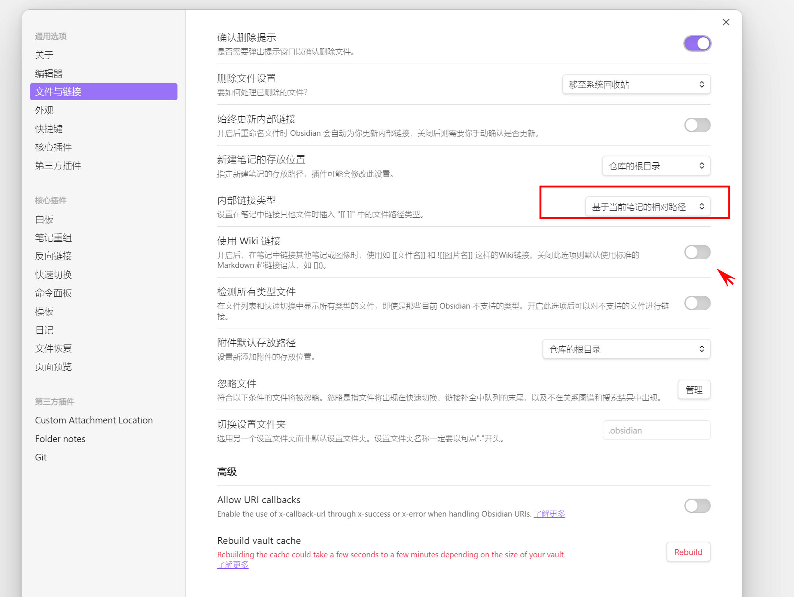
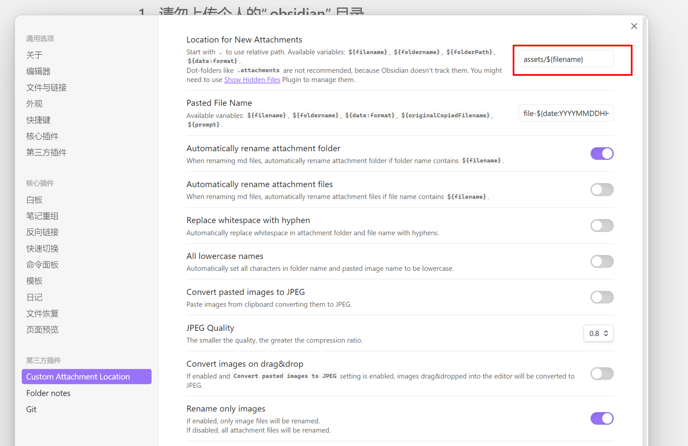

# 共享知识库文档

## 现有成员
- [SevenDreamer](https://github.com/SevenDreamer)
- [Hack-wu](https://github.com/Hack-wu)
- [forever-study](https://github.com/forever-study)
- [tang202388](https://github.com/tang202388)

## 知识库维护
*  基于main分支创建自己的分支，随后在自己的分支上进行修改。
* 将修改好的内容合并到main分支，然后推送。
* 注意： 尽量在原有的内容上进行新增，或小范围修改，不然容易引起较大的冲突。
	* 如果修改原内容较多，请提前与成员沟通后再合并。
* commit时尽量写明修改内容

# obsidian 相关使用要求

## 1、暂时请勿上传个人的“.obsidian” 目录

## 2、配置要求
* 内部链接类型必须使用“==基于当前笔记的相对路径==”，以及关闭“==使用wiki链接==”

## 3、需要安装的插件以及配置

* git 方便管理和提交修改
* Custom Attachment location，用于管理图片等附件链接，红框中的设置请保持一致。assets目录用于统一存放图片

	

